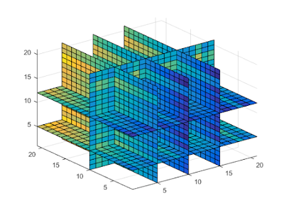

# Cubo de dados para análise de séries de imagens de satélite

Esse repositório é um caderno de projeto que utiliza a biblioteca gdalcubes para analisar um conjunto de imagens do sensor MSI a bordo dos satélites Sentinel-2A e Sentinel-2B.

