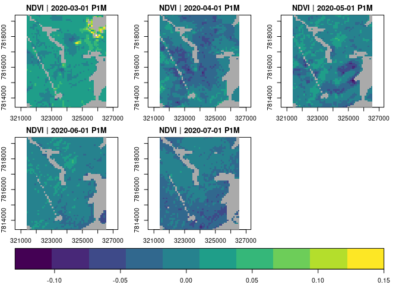
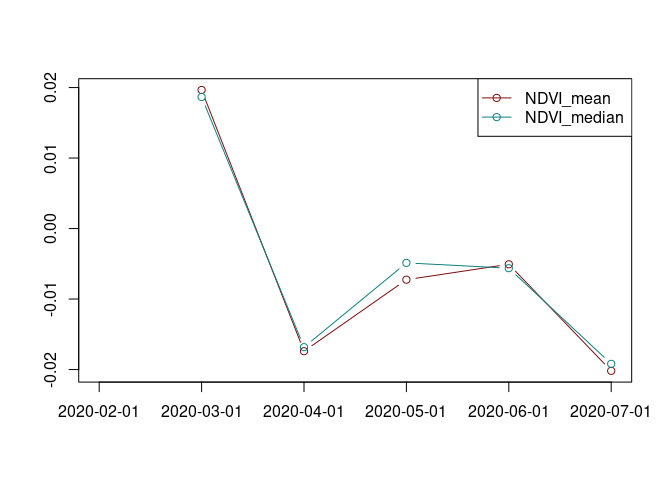

### Cubo de dados para análise de séries de imagens de satélite


° Em uma coleção de imagens aplicou-se uma redução temporal da série para um intervalo mensal.

° Foi criado um cubo de dados raster contendo 6 imagens correspondendo ao intervalo mês a mês da série e calculado o índice de vegetação de diferença normalizada NDVI.

° No cubo de dados foi aplicado uma função redutora em uma janela móvel sobre a dimensão do tempo. Filtro de kernel da diferença simples Tt - T (t-1).


```

Script R e relatório contendo o fluxo do procedimento

``` 


<p align="center" width="100%">
     
</p>

<p align="center" width="100%">
     
</p>


#### Referências:

Appel M, Pebesma E (2019). “On-Demand Processing of Data Cubes from Satellite Image Collections with the gdalcubes Library.” Data, 4(3). https://www.mdpi.com/2306-5729/4/3/92.

Appel M, Pebesma E, Mohr M (2021). “Cloud-based processing of satellite image collections in R using STAC, COGs, and on-demand data cubes.” Blog post on r-spatial.org, https://r-spatial.org/r/2021/04/23/cloud-based-cubes.html.


