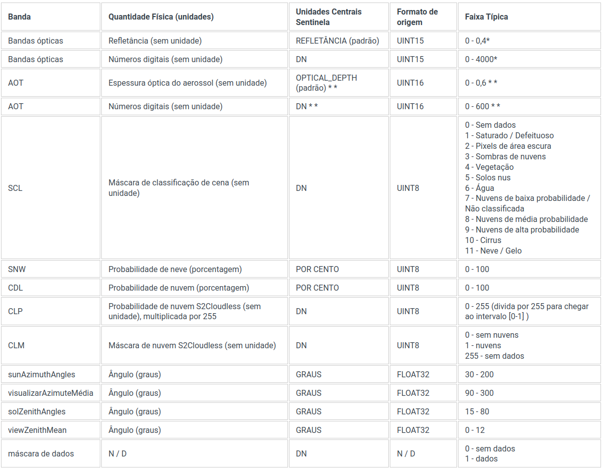
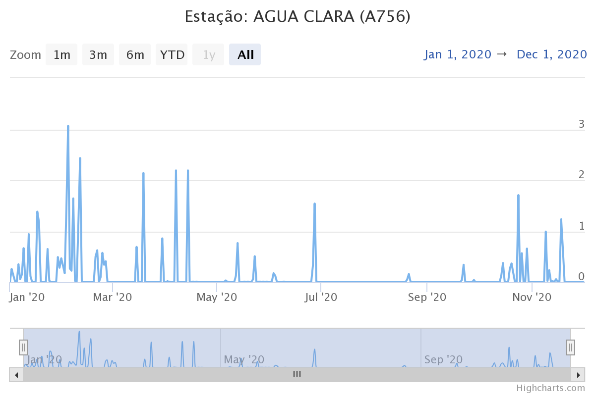
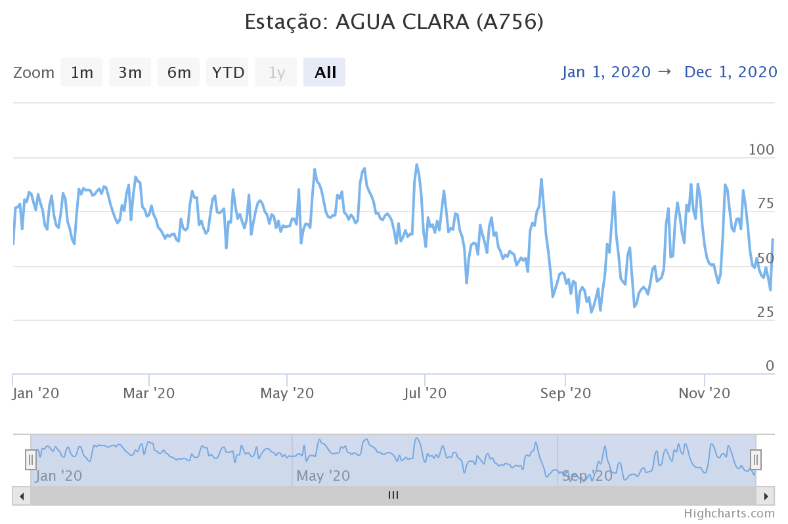
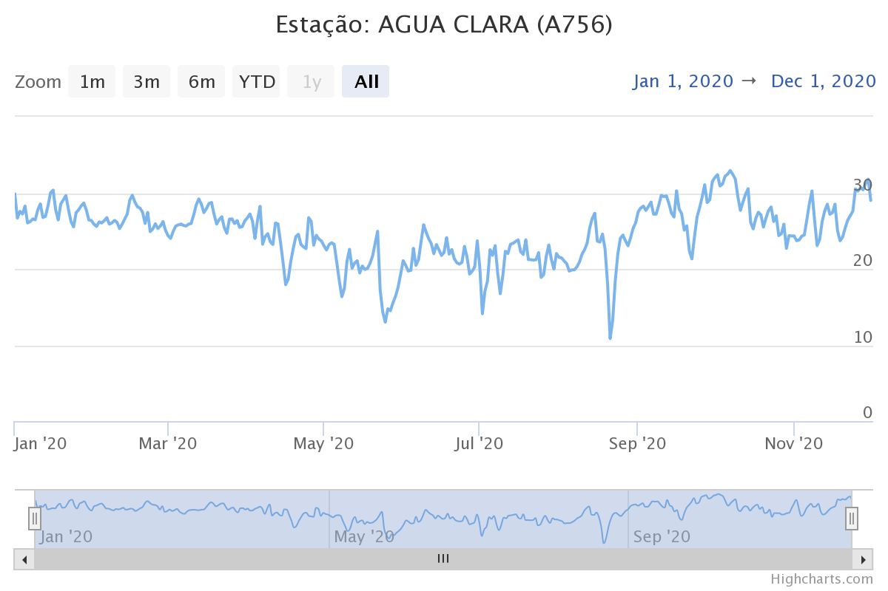

```{r setup, include=FALSE}
knitr::opts_chunk$set(echo = TRUE)
```


No contexto de sensoriamento remoto e observação da Terra, spatiotemporal array refere-se a matrizes multidimensionais onde duas dimensões representam as dimensões  espaciais do raster e o terceiro o tempo (ou a banda). Essa abordagem permite otimizar o acesso e a recuperação de informações específicas em determinados momentos ou locais para séries espaço-temporais.

```{r fig_cube, include=TRUE, echo=FALSE, out.width = '40%', fig.align='center'}
knitr::include_graphics('./img/fig-cube-1.png')
```

Em um cubo de dados, entretanto, também são considerados cubos de dimensões superiores (hipercubos), como um cubo de cinco dimensões onde, além do tempo, a banda espectral e o sensor formam dimensões.

É uma estrutura eficiente para a manipulação de séries temporais de dados raster, permitindo declarar operações algébricas e aplicar funções a um conjunto limitado de dimensões para realizar cálculos e transformações pixel a pixel e criar novas representações dos dados. 

A seguir iremos explorar a biblioteca gdalcubes para analisar um conjunto de imagens do sensor MSI a bordo dos satélites Sentinel-2A e Sentinel-2B. 


## gdalcubes

[gdalcubes](https://gdalcubes.github.io/) é um pacote R e uma biblioteca C++ para o processamento de grandes coleções de imagens de satélite. 


```{r library, include=TRUE, echo=TRUE }

library(magrittr)
library(gdalcubes)
packageVersion("gdalcubes")

```


```{r img.collection_2, include=TRUE, echo=TRUE, eval=TRUE}

# Cria uma coleção de imagens gdalcubes

if(!file.exists(file.path("./", "S2_collection.db" ))){
 S2_download_zip = list.files( paste("..", "TS_gdalcubes", "Sentinel2_15bands",  "raw/", sep='/'),
                     pattern = ".zip$",  full.names = TRUE, recursive = TRUE )
 
 create_image_collection(
   files = S2_download_zip, format='Sentinel2_L2A',
   unroll_archives=TRUE, out_file=file.path(
     "./",  "S2_collection.db"))
     }

```


```{r fig_gdalcube, include=TRUE, echo=FALSE, out.width = '60%', fig.align='center'}
knitr::include_graphics('./img/cube.png')
```


```{r img.collection.2, include=FALSE, echo=FALSE, eval=TRUE}


S2_collection <- image_collection(file.path(
  "./", "S2_collection.db"))  

S2_collection

```


Uma view define a geometria espaço-temporal sem conectá-la ao conjuntos de dados específicos. Isso é especialmente útil quando se trabalha com grandes volumes de dados raster. É uma representação específica da série temporal que pode ser definida pela geometria do cubo.

Uma view do cubo de dados contém o sistema de referência espacial (SRS), a extensão espaçotemporal (esquerda, direita, inferior, superior, data/hora de início, data/hora de término) e o tamanho espaçotemporal dos pixels (tamanho espacial, duração temporal).

Por exemplo podemos criar uma view que aplica uma reamostragem dos pixels para 250 m e uma agragação temporal pela mediana de um intervalo mensal para obter uma visão geral da série. 


```{r overview, include=TRUE, echo=TRUE, eval=TRUE, message=FALSE, warning=FALSE}

 # Visão geral da cena
v.overview = cube_view(
  extent=S2_collection, 
  dx=250, dy=250, # 250 m x 250 m
  resampling = "bilinear", # interpolador da reamostragem
  srs="EPSG:31982", # projeção de destino
  dt="P1M", aggregation = "median" # mediana para o mês.
  )

```


A combinação de uma visualização de cubo de dados com uma coleção de imagens produz um cubo de dados raster regular com dados de banda da coleção de imagens e geometria da visualização de cubo de dados.


```{r overview_2, include=TRUE, echo=TRUE, eval=TRUE, message=FALSE, warning=FALSE}


 cube.overview <-  raster_cube( S2_collection, v.overview) 


```


## Conjunto de dados


O conjunto de dados contém 19 cenas (total de 21 GB) de uma área de Cerrado do Estado de Mato Grosso do Sul adquiridas entre fevereiro e julho de 2020.


```{r size.draft, include=TRUE, echo=FALSE }

s2_files <- list.files( paste("../", "Sentinel2_15bands",  "raw", sep="/"),
    pattern = ".zip$", recursive = TRUE )


 files.size <- 21.2

```


```{r files, include=TRUE, echo=TRUE, eval=FALSE }


s2_files <- list.files(paste("..", "TS_gdalcubes", "Sentinel2_15bands",  "raw", sep="/"),
                                   pattern = ".zip$", recursive = TRUE )
s2_files

files.size <- sum(file.size(s2_files)) / 1000^3 # gigabytes
files.size

v.overview

```


```{r size.draft.out, include=TRUE, echo=FALSE }

s2_files

files.size

v.overview 
```


```{r overview_plot, include=TRUE, echo=FALSE, eval=TRUE, message=FALSE, warning=FALSE, fig.align='center', out.width = '150%'}


  raster_cube( S2_collection, v.overview) %>%
  select_bands(c("B02","B03","B04")) %>% # RGB
  plot(zlim=c(0,1200), rgb=3:1, key.pos=1, ncol =3, nrow=2 )

```


A região da cena compreende uma área ocupada predominantemente por pastagens extensivas e reflorestamentos de eucaliptos. Podemos obter o NDVI da série para e definir uma região específica para observar um povoamento de Eucalyptus Urograndis.

```{r euc_rgb, include=TRUE, echo=FALSE, eval=TRUE, message=FALSE, warning=FALSE, out.width = '75%', fig.align='center', fig.pos="H"}

v.euc = cube_view(
  extent=list(S2_collection, left=321434.9, right=326500,
              bottom=7813432, top=7819363,
             t0="2020-02-15", t1="2020-07-31"),
            dt="P1M", dx=50, dy=50, srs="EPSG:31982",
            aggregation = "median", resampling = "bilinear")


# RGB


  raster_cube( S2_collection, v.euc) %>%
  select_bands(c("B02","B03","B04")) %>% # RGB
    reduce_time(c("median(B02)","median(B03)","median(B04)")) %>%
  plot(zlim=c(0,1200), rgb=3:1, key.pos=1, ncol =1, nrow=1 )

# library(viridis)
# raster_cube( S2_collection, v.euc, mask = s2.clear.mask) %>%
#    select_bands(c("B04","B08", "SCL")) %>%
#   apply_pixel(c("(B08-B04)/(B08+B04)"), names="NDVI") %>%
#   filter_pixel("NDVI > 0.7") %>%
#   #animate(zlim=c(0.3,0.95),col=viridis, key.pos=1)
#   # plot(zlim=c(100,1200), rgb=3:1,  ncol =3, nrow=2 )
#   plot(zlim=c(0.4, 0.9), key.pos=1,  ncol =3, nrow=2, col=viridis)

```


O produto [L2A](https://docs.sentinel-hub.com/api/latest/data/sentinel-2-l2a/) inclui bandas de máscara e  sinalizadores de qualidade de pixels, entre outras camadas que podem ser usadas para filtrar pixels espúrios ou atender determinada análise.

As máscaras são aplicadas em imagens e não em cubos. Os valores mascarados não contribuirão para a agregação de pixels.


```{r scl_mask, include=TRUE, echo=TRUE, eval=TRUE, message=FALSE, warning=FALSE}

s2.clear.mask <- image_mask("SCL", values= c(0,1,2,3,5,6,7,8,9,10,11 )) # Vegetação

```


```{r fig_scl, include=FALSE, echo=FALSE, out.width = '75%', fig.align='center'}

```


```{r euc_ndvi, include=TRUE, echo=TRUE, eval=TRUE, message=FALSE, warning=FALSE, fig.align='center', out.width = '150%'}

v.euc = cube_view(
  extent=list(S2_collection, left=321434.9, right=326500,
              bottom=7813432, top=7819363,
             t0="2020-02-15", t1="2020-07-31"),
            dt="P1M", dx=100, dy=100, srs="EPSG:31982",
            aggregation = "median", resampling = "bilinear")


# NDVI

month_euc_ndvi <- raster_cube( S2_collection, v.euc, mask = s2.clear.mask) %>%
   select_bands(c("B04","B08", "SCL")) %>%
  apply_pixel(c("(B08-B04)/(B08+B04)"), names="NDVI") 

# kNDVI

month_euc_kndvi <- raster_cube( S2_collection, v.euc, mask = s2.clear.mask) %>%
   select_bands(c("B04","B04","B08", "SCL")) %>% 
 apply_pixel("tanh(((B08-B04)/(B08+B04))^2)", "kNDVI") 

library(viridis)
month_euc_ndvi %>%  filter_pixel("NDVI > 0.7") %>% 
  plot(zlim=c(0.55, .9), key.pos=1,  ncol =3, nrow=2, col=viridis)


```


```{r reduce_space_ndvi, include=TRUE, echo=TRUE, eval=TRUE, message=FALSE, warning=FALSE, fig.align='center', out.width = '95%'}

month_euc_ndvi %>% filter_pixel("NDVI > 0.7") %>% 
  reduce_space(#"sum(NDVI)",
               "mean(NDVI)",
               "min(NDVI)",
               "max(NDVI)",
               "median(NDVI)",
               "sd(NDVI))", 
                "count(NDVI)", 
               "var(NDVI)") %>%
  plot(ncol =4, nrow=2)


```


```{r reduce_space_kndvi, include=TRUE, echo=FALSE, eval=FALSE, message=FALSE, warning=FALSE, fig.align='center', out.width = '85%'}

month_euc_kndvi %>%
  filter_pixel("kNDVI > 0.7") %>% 
  reduce_space(#"sum(kNDVI)",
               "mean(kNDVI)",
               "min(kNDVI)", 
               "max(kNDVI)",
               "median(kNDVI)",
               "sd(kNDVI)",
                "count(kNDVI)",
                "var(kNDVI)") %>%  plot(ncol =4, nrow=2, )


```


Os dados do NDVI seguem a tendência esperada para o período seco caracteristico da região para o intervalo analisado. É de se esperar que quanto mais próximo do auge do período seco os fatores climáticos afetem o metabolismo das plantas, resultando em valores menores para o NDVI.


Os [dados do INMET](https://tempo.inmet.gov.br/GraficosAnuais) apontam para uma condição típica do clima da região, onde os máximos da temperatura são alcançados no inverno do hemisfério sul, coincindindo com os mínimos de umidade do ar e longos períodos de estiagem.


```{r fig_precp_AC, include=TRUE, echo=FALSE, out.width = '60%', fig.align='center', fig.cap="Precipitação (mm) para estação Água Clara (A758)" }

```


```{r fig_umid_AC, include=TRUE, echo=FALSE, out.width = '60%', fig.align='center', fig.cap="Umidade do ar (%) para estação Água Clara (A758)" }

```


```{r fig_temp_AC, include=TRUE, echo=FALSE, out.width = '60%', fig.align='center', fig.cap="Temperatura (ºC) para estação Água Clara (A758)" }

```


Dado esse contexto, uma pergunta interessante de ser respondida é se:

Mesmo havendo uma tendência de global de diminuição do valor do NDVI nos dados analisados, seria possível detectar uma situação de alteração da dinâmica da atividade de fotosíntese correspondente a fatores externos ao clima, como intervenções de manejo ou estresse causado por pragas ou doenças?


Ao analisar o comportamento da média e da  mediana no período é possível observar uma atenuação da tendência de diminuição do NDVI entre abril e junho,  com o pico da inflexão no mês de maio.  

```{r reduce_space_ndvi2, include=TRUE, echo=FALSE, eval=TRUE, message=FALSE, warning=FALSE, fig.align='center', out.width = '75%', fig.cap= "Média e a Mediana da série mensal"}

month_euc_ndvi %>% filter_pixel("NDVI > 0.7") %>% 
  reduce_space(#"sum(NDVI)",
               "mean(NDVI)",
               # "min(NDVI)",
               # "max(NDVI)",
               "median(NDVI)") %>%
               # "sd(NDVI))", 
                # "count(NDVI)", 
               # "var(NDVI)") %>%
  # plot(ncol =2, nrow=1)
  plot(join.timeseries = TRUE)

```


```{r reduce_time_quantil, include=TRUE, echo=FALSE, eval=FALSE, message=FALSE, warning=FALSE, fig.align='center', out.width = '150%'}

# quantile as a variable into the function -> works well
# L8.cube %>%
#   select_bands("B04") %>%
#   reduce_time(names = "q75_R", FUN = function(x, q = .75){
#     quantile(x["B04",], q, na.rm = T)
#   }) %>%
#   plot()

```


## Detecção de mudanças

Podemos derivar as diferenças mensais para analisar o comportamento da diminuição do valor do NDVI no decorrer dos meses $T_t - T_t-_1$.   A função  `window_time()`  aplica o filtro de diferença de kernel para a série mensal. 

```{r euc_change, include=TRUE, echo=TRUE, eval=TRUE, message=FALSE, warning=FALSE, fig.align='center', out.width = '150%'}

# Diferença mensal

month_euc_ndvi %>%  filter_pixel("NDVI > 0.7") %>% 
  window_time(kernel=c(-1,1), window=c(1,0)) %>%
  plot(zlim=c(-.13, .15), key.pos=1,   col= viridis,  t = 2:6, ncol = 3 )


```


```{r reduce_space_change, include=TRUE, echo=FALSE, eval=TRUE, message=FALSE, warning=FALSE, fig.align='center', out.width = '75%', fig.cap= "Média e a Mediana da diferença simples para a série mensal  $T_t - T_t-_1$" }

month_euc_ndvi %>%  filter_pixel("NDVI > 0.7") %>% 
  window_time(kernel=c(-1,1), window=c(1,0)) %>%
  reduce_space(#"sum(NDVI)",
               "mean(NDVI)",
               # "max(NDVI)",
               "median(NDVI)") %>%
               #  "sd(NDVI))",
               # "min(NDVI)") %>%
               # "count(NDVI)",
               # "var(NDVI)") %>%
  # plot(ncol =2, nrow=2, list( main = c("Média da diferença mensal", "Mediana da  diferença mensal ")))
  # plot(ncol =2, nrow=1, list( main = c("Média da diferença mensal", "Mediana da  diferença mensal ")))
plot(join.timeseries = TRUE)
  # title(main =  list("Média da diferença mensal", "Mediana da  diferença mensal "))
```

A média e a mediana da diferença simples mostram uma estagnação da tendência diminuição do NDVI, com o valor da média da diferença superior a mediana da diferença no mês de junho. Esse comportamento aponta para a diminuição da magnitude da taxa de mudança que pode indicar uma redução na intensidade da tendência podendo ser observada no gráfico entre os mêses de Maio e Junho. 


A mudança positiva entre no intervalo Fevereiro-Março pode ser decorrente das chuvas que ocorreram durante o período, o que não pode ser observado para o intervalo seguinte mesmo com a continuação de eventos de chuva no mês de abril. Isso poderia estar relacionado a algum 'fator externo' aos dados analisados até aqui?


Observando o gráfico da média e da mediana da diferença podemos considerar três padrões de tendência, representados no gráfico pelos intervalos (1) Março-Abril, (2) Abril-junho, (3) Junho-Julho. 

A inclinação da diferença entre junho-julho é menor que a de março-abril, o que é contrário a tendência das variáveis climáticas, enquanto a série avança para o auge do período seco do ano, com os mínimos da umidade do ar entre agosto e outubro. 


Diferenças abslutas menores do NDVI ocorreram de maneira significativa na área analisada, entre os meses de abril e junho, consecutivamente ($Maio - Abril$ ; $Junho - Maio$). Existe algum padrão ou arranjo espacial dos valores da diferença simples, orientação preferencial SO-NE?

```{r euc_change_filt, include=TRUE, echo=TRUE, eval=TRUE, message=FALSE, warning=FALSE, fig.align='center', out.width = '150%'}

month_euc_ndvi %>%  filter_pixel("NDVI > 0.7") %>% 
  window_time(kernel=c(-1,1), window=c(1,0)) %>%
  filter_pixel("NDVI > 0.0") %>% 
  plot(zlim=c(0.0, .12), key.pos=1,   col= viridis,  t = 2:6, ncol = 3 )


```


## Análise de tendências.


continua (...)


