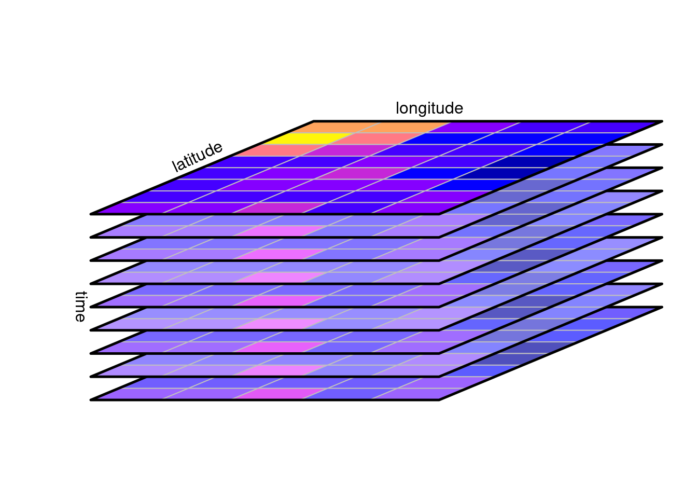
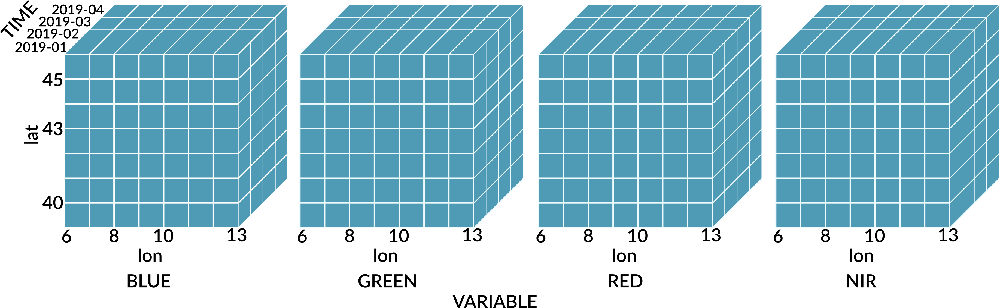
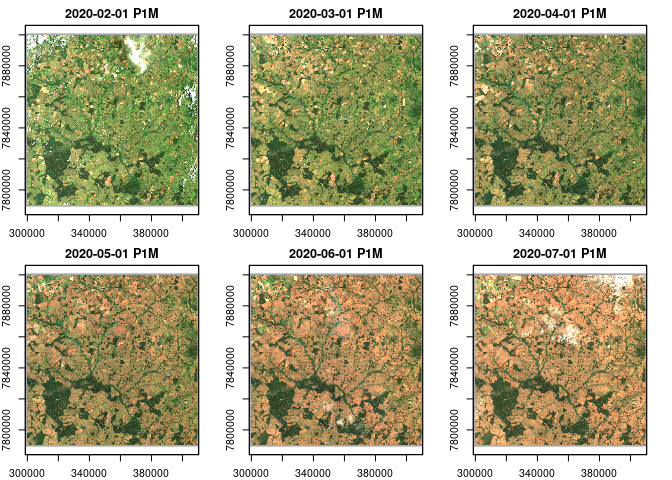
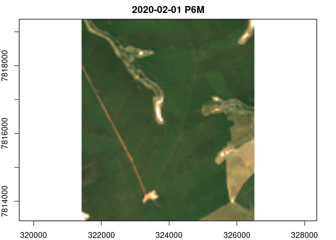
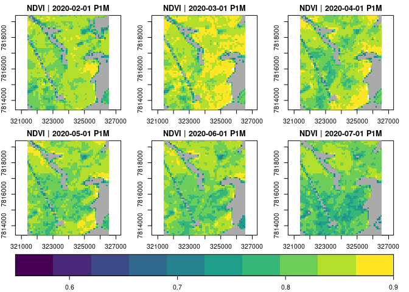
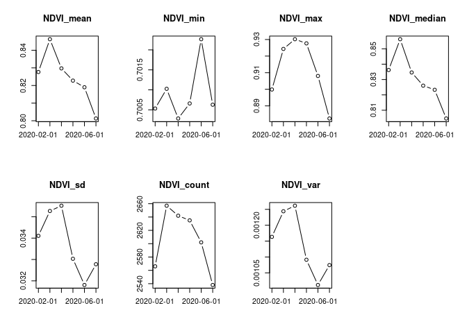
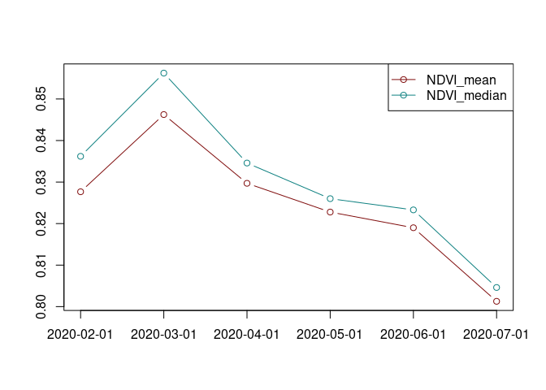
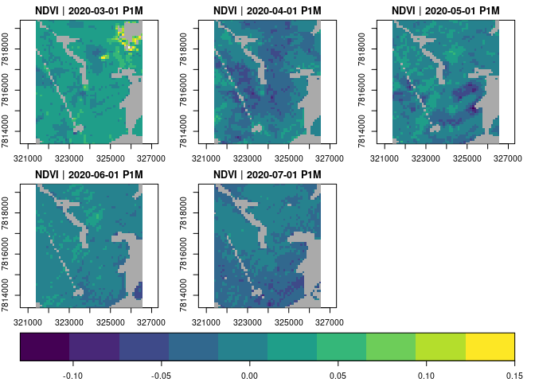
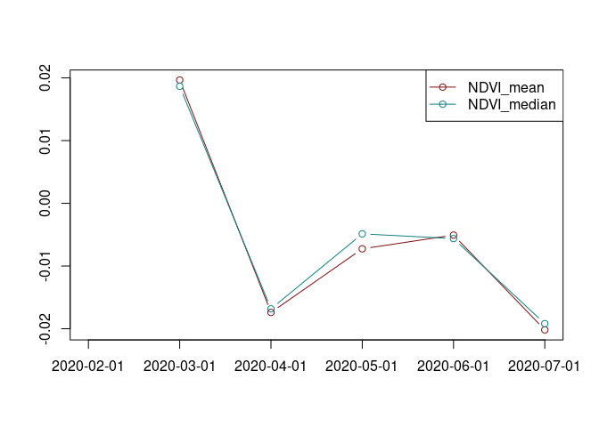
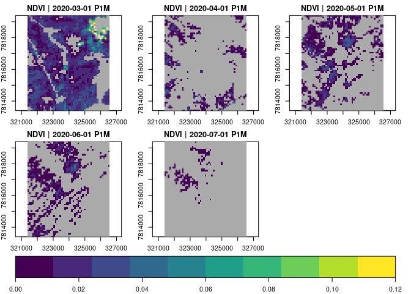

No contexto de sensoriamento remoto e observação da Terra,
spatiotemporal array refere-se a matrizes multidimensionais onde duas
dimensões representam as dimensões espaciais do raster e o terceiro o
tempo (ou a banda). Essa abordagem permite otimizar o acesso e a
recuperação de informações específicas em determinados momentos ou
locais para séries espaço-temporais.



Em um cubo de dados, entretanto, também são considerados cubos de
dimensões superiores (hipercubos), como um cubo de cinco dimensões onde,
além do tempo, a banda espectral e o sensor formam dimensões.

É uma estrutura eficiente para a manipulação de séries temporais de
dados raster, permitindo declarar operações algébricas e aplicar funções
a um conjunto limitado de dimensões para realizar cálculos e
transformações pixel a pixel e criar novas representações dos dados.

A seguir iremos explorar a biblioteca gdalcubes para analisar um
conjunto de imagens do sensor MSI a bordo dos satélites Sentinel-2A e
Sentinel-2B.

## gdalcubes

[gdalcubes](https://gdalcubes.github.io/) é um pacote R e uma biblioteca
C++ para o processamento de grandes coleções de imagens de satélite.

``` r
library(magrittr)
library(gdalcubes)
packageVersion("gdalcubes")
```

    ## [1] '0.6.4'

``` r
# Cria uma coleção de imagens gdalcubes

if(!file.exists(file.path("./", "S2_collection.db" ))){
 S2_download_zip = list.files( paste("..", "TS_gdalcubes", "Sentinel2_15bands",  "raw/", sep='/'),
                     pattern = ".zip$",  full.names = TRUE, recursive = TRUE )
 
 create_image_collection(
   files = S2_download_zip, format='Sentinel2_L2A',
   unroll_archives=TRUE, out_file=file.path(
     "./",  "S2_collection.db"))
     }
```



Uma view define a geometria espaço-temporal sem conectá-la ao conjuntos
de dados específicos. Isso é especialmente útil quando se trabalha com
grandes volumes de dados raster. É uma representação específica da série
temporal que pode ser definida pela geometria do cubo.

Uma view do cubo de dados contém o sistema de referência espacial (SRS),
a extensão espaçotemporal (esquerda, direita, inferior, superior,
data/hora de início, data/hora de término) e o tamanho espaçotemporal
dos pixels (tamanho espacial, duração temporal).

Por exemplo podemos criar uma view que aplica uma reamostragem dos
pixels para 250 m e uma agragação temporal pela mediana de um intervalo
mensal para obter uma visão geral da série.

``` r
 # Visão geral da cena
v.overview = cube_view(
  extent=S2_collection, 
  dx=250, dy=250, # 250 m x 250 m
  resampling = "bilinear", # interpolador da reamostragem
  srs="EPSG:31982", # projeção de destino
  dt="P1M", aggregation = "median" # mediana para o mês.
  )
```

A combinação de uma visualização de cubo de dados com uma coleção de
imagens produz um cubo de dados raster regular com dados de banda da
coleção de imagens e geometria da visualização de cubo de dados.

``` r
 cube.overview <-  raster_cube( S2_collection, v.overview) 
```

## Conjunto de dados

O conjunto de dados contém 19 cenas (total de 21 GB) de uma área de
Cerrado do Estado de Mato Grosso do Sul adquiridas entre fevereiro e
julho de 2020.

``` r
s2_files <- list.files(paste("..", "TS_gdalcubes", "Sentinel2_15bands",  "raw", sep="/"),
                                   pattern = ".zip$", recursive = TRUE )
s2_files

files.size <- sum(file.size(s2_files)) / 1000^3 # gigabytes
files.size

v.overview
```

    ## character(0)

    ## [1] 21.2

    ## A data cube view object
    ## 
    ## Dimensions:
    ##                low             high count pixel_size
    ## t       2020-02-01       2020-07-31     6        P1M
    ## y 7789200.49146679 7900950.49146679   447        250
    ## x 298688.080453591 410438.080453591   447        250
    ## 
    ## SRS: "EPSG:31982"
    ## Temporal aggregation method: "median"
    ## Spatial resampling method: "bilinear"



A região da cena compreende uma área ocupada predominantemente por
pastagens extensivas e reflorestamentos de eucaliptos. Podemos obter o
NDVI da série para e definir uma região específica para observar um
povoamento de Eucalyptus Urograndis.



O produto
[L2A](https://docs.sentinel-hub.com/api/latest/data/sentinel-2-l2a/)
inclui bandas de máscara e sinalizadores de qualidade de pixels, entre
outras camadas que podem ser usadas para filtrar pixels espúrios ou
atender determinada análise.

As máscaras são aplicadas em imagens e não em cubos. Os valores
mascarados não contribuirão para a agregação de pixels.

``` r
s2.clear.mask <- image_mask("SCL", values= c(0,1,2,3,5,6,7,8,9,10,11 )) # Vegetação
```

``` r
v.euc = cube_view(
  extent=list(S2_collection, left=321434.9, right=326500,
              bottom=7813432, top=7819363,
             t0="2020-02-15", t1="2020-07-31"),
            dt="P1M", dx=100, dy=100, srs="EPSG:31982",
            aggregation = "median", resampling = "bilinear")


# NDVI

month_euc_ndvi <- raster_cube( S2_collection, v.euc, mask = s2.clear.mask) %>%
   select_bands(c("B04","B08", "SCL")) %>%
  apply_pixel(c("(B08-B04)/(B08+B04)"), names="NDVI") 

# kNDVI

month_euc_kndvi <- raster_cube( S2_collection, v.euc, mask = s2.clear.mask) %>%
   select_bands(c("B04","B04","B08", "SCL")) %>% 
 apply_pixel("tanh(((B08-B04)/(B08+B04))^2)", "kNDVI") 

library(viridis)
month_euc_ndvi %>%  filter_pixel("NDVI > 0.7") %>% 
  plot(zlim=c(0.55, .9), key.pos=1,  ncol =3, nrow=2, col=viridis)
```



``` r
month_euc_ndvi %>% filter_pixel("NDVI > 0.7") %>% 
  reduce_space(#"sum(NDVI)",
               "mean(NDVI)",
               "min(NDVI)",
               "max(NDVI)",
               "median(NDVI)",
               "sd(NDVI))", 
                "count(NDVI)", 
               "var(NDVI)") %>%
  plot(ncol =4, nrow=2)
```



Os dados do NDVI seguem a tendência esperada para o período seco
caracteristico da região para o intervalo analisado. É de se esperar que
quanto mais próximo do auge do período seco os fatores climáticos afetem
o metabolismo das plantas, resultando em valores menores para o NDVI.

Os [dados do INMET](https://tempo.inmet.gov.br/GraficosAnuais) apontam para uma condição típica do clima da região para o período, coincindindo com os mínimos de umidade do ar e longos períodos de estiagem.


<p class="caption">
Precipitação (mm) para estação Água Clara (A758)
</p>


<p class="caption">
Umidade do ar (%) para estação Água Clara (A758)
</p>


<p class="caption">
Temperatura (ºC) para estação Água Clara (A758)
</p>

Dado esse contexto, uma pergunta interessante de ser respondida é se:

Mesmo havendo uma tendência de global de diminuição do valor do NDVI nos
dados analisados, seria possível detectar uma situação de alteração da
dinâmica da atividade de fotosíntese correspondente a fatores externos
ao clima, como intervenções de manejo ou estresse causado por pragas ou
doenças?

Ao analisar o comportamento da média e da mediana no período é possível
observar uma atenuação da tendência de diminuição do NDVI entre abril e
junho, com o pico da inflexão no mês de maio.


<p class="caption">
Média e a Mediana da série mensal
</p>

## Detecção de mudanças

Podemos derivar as diferenças mensais para analisar o comportamento da
diminuição do valor do NDVI no decorrer dos meses
*T*<sub>*t*</sub> − *T*<sub>*t*</sub>−<sub>1</sub>. A função
`window_time()` aplica o filtro de diferença de kernel para a série
mensal.

``` r
# Diferença mensal

month_euc_ndvi %>%  filter_pixel("NDVI > 0.7") %>% 
  window_time(kernel=c(-1,1), window=c(1,0)) %>%
  plot(zlim=c(-.13, .15), key.pos=1,   col= viridis,  t = 2:6, ncol = 3 )
```




<p class="caption">
Média e a Mediana da diferença simples para a série mensal
*T*<sub>*t*</sub> − *T*<sub>*t*</sub>−<sub>1</sub>
</p>

A média e a mediana da diferença simples mostram uma estagnação da
tendência diminuição do NDVI, com o valor da média da diferença superior
a mediana da diferença no mês de junho. Esse comportamento aponta para a
diminuição da magnitude da taxa de mudança que pode indicar uma redução
na intensidade da tendência podendo ser observada no gráfico entre os
mêses de Maio e Junho.

A mudança positiva entre no intervalo Fevereiro-Março pode ser
decorrente das chuvas que ocorreram durante o período, o que não pode
ser observado para o intervalo seguinte mesmo com a continuação de
eventos de chuva no mês de abril. Isso poderia estar relacionado a algum
‘fator externo’ aos dados analisados até aqui?

Observando o gráfico da média e da mediana da diferença podemos
considerar três padrões de tendência, representados no gráfico pelos
intervalos (1) Março-Abril, (2) Abril-junho, (3) Junho-Julho.

A inclinação da diferença entre junho-julho é menor que a de
março-abril, o que é contrário a tendência das variáveis climáticas,
enquanto a série avança para o auge do período seco do ano, com os
mínimos da umidade do ar entre agosto e outubro.

Diferenças abslutas menores do NDVI ocorreram de maneira significativa
na área analisada, entre os meses de abril e junho, consecutivamente
(*M**a**i**o* − *A**b**r**i**l* ; *J**u**n**h**o* − *M**a**i**o*).
Existe algum padrão ou arranjo espacial dos valores da diferença
simples, orientação preferencial SO-NE?

``` r
month_euc_ndvi %>%  filter_pixel("NDVI > 0.7") %>% 
  window_time(kernel=c(-1,1), window=c(1,0)) %>%
  filter_pixel("NDVI > 0.0") %>% 
  plot(zlim=c(0.0, .12), key.pos=1,   col= viridis,  t = 2:6, ncol = 3 )
```



## Análise de tendências.

continua (…)
